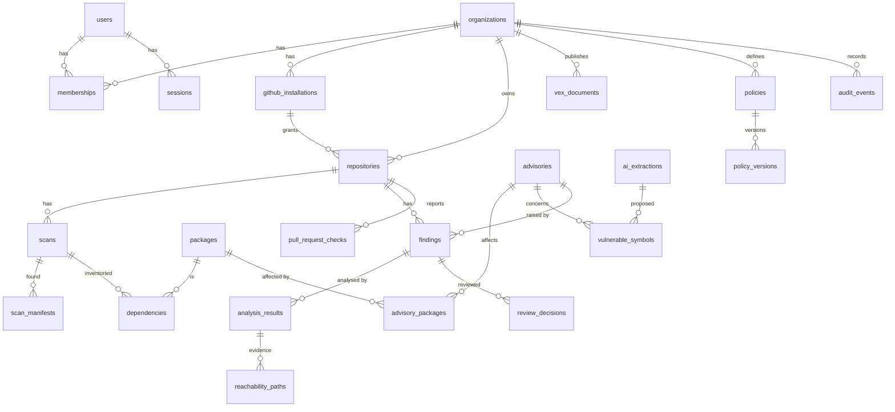

# Database schema

PostgreSQL 16. The SQLAlchemy models in `backend/src/sieve/db/models/` are the source of truth;
Alembic migrations in `backend/src/sieve/db/migrations/` (shipped inside the package) are generated
from them and reviewed by hand. Hand-written parts — append-only triggers, foreign keys that close a
cycle — are marked in the migration. A test fails if models and migrations ever disagree.

## Conventions

| Convention | Rule |
|---|---|
| Primary keys | `uuid`, generated application-side as UUIDv7 (time-ordered → index-friendly inserts). Exception: `audit_events.seq` is a `bigint` identity because ordering is the point. |
| Timestamps | `timestamptz`, always UTC, `created_at` default `now()`. `updated_at` only on mutable rows. |
| Enums | `text` + `CHECK` constraint, not native PG enums (adding a value to a PG enum is awkward in migrations; CHECK constraints are trivially altered). |
| Tenant scope | Every tenant-owned table has `organization_id NOT NULL` (denormalised where needed) so every query can be scoped without joins. |
| Soft delete | Not used. Repositories are *deactivated* (`is_active=false`) because their findings and audit history must survive; nothing else needs soft delete. |
| Large data | Never in Postgres. SBOMs, call-graph snapshots, VEX documents and evidence bundles live in S3, referenced by `*_key` + `*_sha256`. |
| Concurrency | `findings.version` integer for optimistic locking (`UPDATE … WHERE id=:id AND version=:v`). |

## Entity overview

## Tables

### Identity and tenancy

**users** — a GitHub user who has logged in.
`id`, `github_user_id bigint UNIQUE`, `login`, `name`, `avatar_url`, `created_at`, `updated_at`.
No email is stored unless a feature needs it.

**organizations** — tenant boundary. Maps 1:1 to a GitHub account (user or org) that installed the
App, plus one built-in demo organization.
`id`, `github_account_id bigint UNIQUE NULL`, `login`, `account_type CHECK IN ('user','organization','demo')`, `created_at`.

**memberships** — authorisation. `(organization_id, user_id)` PK, `role CHECK IN ('owner','admin','member','viewer')`.
Synchronised from GitHub on login/installation events; Sieve never grants access GitHub did not.

**sessions** — server-side sessions (cookie holds an opaque random token; DB stores only its SHA-256).
`id`, `user_id`, `token_hash bytea UNIQUE`, `created_at`, `expires_at`, `revoked_at`.

### GitHub

**github_installations** — `id`, `organization_id`, `github_installation_id bigint UNIQUE`,
`account_login`, `repository_selection`, `permissions jsonb`, `suspended_at`, `created_at`, `updated_at`.
No tokens are stored: installation tokens are minted on demand (1h lifetime) and cached in Redis.

**webhook_deliveries** — replay protection and idempotency.
`github_delivery_id text PK`, `event`, `action`, `github_installation_id`, `received_at`.
Insert-or-ignore on receipt; a delivery GUID seen twice is acknowledged and dropped.

### Repositories and scans

**repositories** — `id`, `organization_id`, `installation_id NULL` (null for demo), `source CHECK IN ('github','demo')`,
`github_repo_id bigint UNIQUE NULL`, `full_name`, `default_branch`, `is_private`, `is_active`,
`latest_scan_id NULL`, `created_at`, `updated_at`. `UNIQUE (organization_id, full_name)`.

**scans** — one analysis of one commit.
`id`, `organization_id`, `repository_id`, `commit_sha`, `ref`, `trigger CHECK IN ('manual','push','pull_request','advisory','schedule','demo')`,
`status CHECK IN ('queued','running','succeeded','failed','cancelled')`, `stage`, `progress jsonb`,
`idempotency_key text UNIQUE`, `analyzer_version`, `sbom_key`, `sbom_sha256`, `stats jsonb`,
`error_code`, `error_message`, `correlation_id`, `created_at`, `started_at`, `finished_at`.

**scan_manifests** — what the inventory stage saw, including what it could *not* handle (§16: "report unsupported formats clearly").
`id`, `scan_id`, `path`, `format`, `status CHECK IN ('parsed','unsupported','error')`, `detail`.

**packages** — `id`, `ecosystem` (`PyPI`), `name` (PEP 503-normalised), `UNIQUE (ecosystem, name)`.

**dependencies** — `id`, `scan_id`, `package_id`, `version NULL` (null = unpinned), `constraint_spec`,
`is_direct`, `manifest_path`, `purl`. `UNIQUE NULLS NOT DISTINCT (scan_id, package_id, version)`.

### Vulnerability intelligence

**advisories** — normalised advisory (OSV is the first source).
`id`, `source`, `source_id`, `aliases text[]`, `summary`, `details`, `severity_level CHECK IN ('critical','high','medium','low','unknown')`,
`cvss_vector`, `cvss_score numeric(3,1)`, `references jsonb`, `published_at`, `modified_at`, `withdrawn_at`,
`content_hash bytea`, `raw jsonb`, `ingested_at`. `UNIQUE (source, source_id)`.

**advisory_packages** — affected package + ranges. `id`, `advisory_id`, `package_id`,
`ranges jsonb` (OSV range events), `versions text[]` (explicit list), `UNIQUE (advisory_id, package_id)`.

**kev_entries** — `cve_id text PK`, `date_added`, `due_date`, `known_ransomware_use`, `vendor`, `product`, `ingested_at`.

**epss_scores** — latest score only. `cve_id text PK`, `score numeric(6,5)`, `percentile numeric(6,5)`, `score_date`, `ingested_at`.

**ingestion_runs** — health of each ingestion. `id`, `source`, `status`, `started_at`, `finished_at`,
`records_seen`, `records_changed`, `records_failed`, `cursor`, `error`.

**ingestion_failures** — per-record dead letters. `id`, `run_id`, `source`, `record_id`, `error`,
`payload_excerpt` (truncated), `created_at`, `resolved_at`.

### Symbols and AI

**ai_extractions** — every model call, successful or not. Doubles as the cache.
`id`, `advisory_id`, `package_id`, `provider`, `model`, `prompt_version`, `input_sha256`,
`status CHECK IN ('succeeded','schema_invalid','provider_error','refused')`, `output jsonb`,
`input_tokens`, `output_tokens`, `cost_usd numeric(10,6)`, `latency_ms`, `error`, `created_at`.
Partial `UNIQUE (input_sha256, provider, model, prompt_version) WHERE status='succeeded'` — the cache key
(failures are recorded but never cached).

**vulnerable_symbols** — `id`, `advisory_id`, `package_id`, `qualified_name`, `kind CHECK IN ('function','method','class','module')`,
`origin CHECK IN ('advisory','ai','curated','reviewer')`, `ai_extraction_id NULL`,
`verification CHECK IN ('verified','rejected','unverified')`, `verification_detail jsonb`
(which version/file/line was checked, which diff hunk matched, why rejected), `created_at`, `updated_at`.
`UNIQUE (advisory_id, package_id, qualified_name)`.

### Findings, analysis, review

**findings** — one advisory affecting one package in one repository.
`id`, `organization_id`, `repository_id`, `advisory_id`, `package_id`, `installed_version NULL`,
`first_seen_scan_id`, `last_seen_scan_id`, `presence CHECK IN ('present','resolved')`,
`analysis_state CHECK IN ('pending','analyzing','analyzed','failed')`,
`verdict NULL CHECK IN ('reachable','not_reached','needs_review')`, `confidence NULL CHECK IN ('high','medium','low')`,
`latest_analysis_id NULL`, `risk_score numeric(5,2)`, `risk_breakdown jsonb`,
`review_state CHECK IN ('unreviewed','accepted','overridden','stale')`, `version int`, `created_at`, `updated_at`.
`UNIQUE (repository_id, advisory_id, package_id)`.

**analysis_results** — immutable record of one reachability run for one finding.
`id`, `finding_id`, `scan_id`, `analyzer_version`, `verdict`, `confidence`, `reasons jsonb`,
`symbols jsonb` (symbol ids + verification state at the time), `stats jsonb`, `created_at`.

**reachability_paths** — `id`, `analysis_result_id`, `rank`, `entrypoint_kind`, `steps jsonb`
(`[{file, line, col, symbol, kind, package?}]`).

**review_decisions** — append-only.
`id`, `finding_id`, `organization_id`, `reviewer_id`, `analysis_result_id NULL` (the evidence version reviewed),
`finding_version`, `previous_verdict`, `decided_verdict`, `vex_status CHECK IN ('not_affected','affected','fixed','under_investigation')`,
`justification` (OpenVEX justification, required when `not_affected`), `comment`, `created_at`.

**vex_documents** — `id`, `organization_id`, `repository_id NULL`, `format CHECK IN ('openvex','cyclonedx')`,
`artifact_key`, `artifact_sha256`, `statement_count`, `schema_valid`, `generated_by`, `created_at`.

### Policy and checks

**policies** — `id`, `organization_id`, `name`, `is_active`, `current_version int`, `created_at`, `updated_at`. `UNIQUE (organization_id, name)`.
**policy_versions** — `id`, `policy_id`, `version`, `rules jsonb`, `created_by NULL`, `created_at`. `UNIQUE (policy_id, version)`. Immutable.

**pull_request_checks** — `id`, `organization_id`, `repository_id`, `pr_number`, `head_sha`, `base_sha`,
`scan_id NULL`, `policy_version_id NULL`, `github_check_run_id NULL`, `conclusion NULL`, `summary jsonb`, `created_at`.
`UNIQUE (repository_id, head_sha)`.

### Infrastructure

**jobs** — the queue ([ADR-0004](decisions/0004-postgres-job-queue.md)).
`id`, `kind`, `payload jsonb`, `status CHECK IN ('pending','running','succeeded','dead')`,
`priority smallint`, `idempotency_key text UNIQUE`, `attempts`, `max_attempts`, `run_after`,
`locked_by`, `lease_expires_at`, `last_error`, `correlation_id`, `organization_id NULL`, `created_at`, `finished_at`.
(There is no terminal `failed` state: a failed attempt either returns to `pending` with backoff or becomes `dead`.)

**audit_events** — append-only, hash-chained.
`seq bigint identity PK`, `id uuid UNIQUE`, `organization_id NULL` (null = system-wide), `actor_type CHECK IN ('user','system','github')`,
`actor_id`, `action`, `target_type`, `target_id`, `data jsonb`, `correlation_id`, `occurred_at`,
`prev_hash bytea`, `hash bytea`.
A trigger raises on `UPDATE`, `DELETE` and `TRUNCATE`. `hash = sha256(prev_hash ‖ canonical_json(event))`, so an
edit made by bypassing the trigger (e.g. as a superuser) is detectable by re-walking the chain.

## Index rationale

Only indexes with a named query behind them.

| Index | Query it serves |
|---|---|
| `jobs (priority, run_after) WHERE status='pending'` (partial) | Worker claim query. Partial keeps it tiny: finished jobs are the vast majority of rows. |
| `jobs (lease_expires_at) WHERE status='running'` | Reaper looking for expired leases. |
| `jobs (created_at) WHERE status='dead'` | Ops view of the dead-letter queue. |
| `scans (repository_id, created_at DESC)` | Repository page: latest scans. |
| `scans (status) WHERE status IN ('queued','running')` | "Active scans" view and SSE bootstrap. |
| `dependencies (package_id)` | Fan-out: which scans contain package P (joined to `repositories.latest_scan_id`). |
| `advisory_packages (package_id)` | Matching: advisories for package P. |
| `advisories USING gin (aliases)` | Join KEV/EPSS by CVE alias; search by any identifier. |
| `advisories (modified_at)` | Incremental ingestion and "recently changed" lists. |
| `findings (organization_id, verdict, risk_score DESC)` | The findings table's default view (filter by verdict, sort by risk). |
| `findings (repository_id, presence)` | Repository page counts. |
| `analysis_results (finding_id, created_at DESC)` | Finding history. |
| `review_decisions (finding_id, created_at)` | Audit timeline on the finding page. |
| `audit_events (organization_id, seq)` | Activity feed and chain verification, in order. |
| `audit_events (target_type, target_id)` | Per-object history. |
| `ai_extractions (advisory_id, package_id)` | Extraction history for a finding. |
| `sessions (user_id)` | Revoke all sessions for a user. |

Foreign-key columns not listed above are covered by the leading column of a unique constraint.

## Transactions and idempotency

| Operation | Guarantee |
|---|---|
| Webhook received | `INSERT webhook_deliveries … ON CONFLICT DO NOTHING`; only the inserting transaction enqueues jobs. |
| Scan requested | `INSERT scans` + `INSERT jobs` in one transaction, both keyed by the same idempotency key. |
| Finding upsert | `INSERT … ON CONFLICT (repository_id, advisory_id, package_id) DO UPDATE` — concurrent scans of the same repo cannot create duplicates. |
| Review decision | `UPDATE findings SET …, version = version + 1 WHERE id = :id AND version = :expected` + `INSERT review_decisions` + `INSERT audit_events` in one transaction; zero rows updated → 409. |
| Advisory upsert | Skipped when `content_hash` unchanged; changed → upsert + enqueue fan-out in one transaction. |
