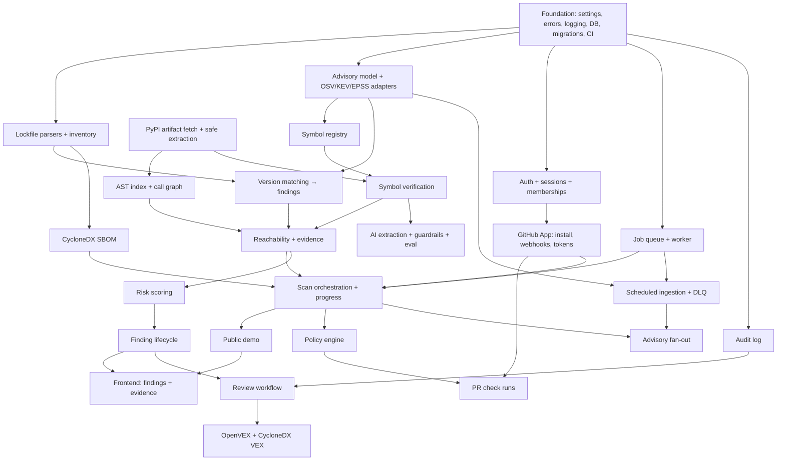

# Development plan

Phase 0, steps 4–5: repository structure and implementation dependency graph.

## Repository structure

Adapted from the spec's suggestion; the reasons for each deviation are in
[spec-review.md §1.5](spec-review.md#15-top-level-analysis-ai-workers-packages-split-one-python-application).

```
sieve/
├── backend/                         one Python distribution: `sieve`
│   ├── pyproject.toml / uv.lock
│   ├── alembic.ini
│   ├── src/sieve/
│   │   ├── core/                    settings, logging, errors, ids, correlation, telemetry
│   │   ├── db/                      engine/session, models/ (one module per aggregate), migrations/
│   │   ├── api/                     app factory, routers/, deps (auth, db), error handlers
│   │   ├── worker/                  runner, queue, handler registry, scheduler
│   │   ├── github/  auth/  scans/  sbom/  advisories/  packages/
│   │   ├── analysis/                ast index, imports, callgraph, reachability, evidence
│   │   ├── ai/                      providers/, prompts/, extraction, guardrails, evaluation
│   │   ├── symbols/  risk/  findings/  reviews/  vex/  policy/  audit/
│   └── tests/
│       ├── unit/  integration/  security/  ai/  e2e/
│       └── conftest.py
├── web/                             Next.js app (TypeScript, Tailwind)
├── demo/vulnerable-python-app/      project-owned sample application for the public demo
├── infrastructure/
│   ├── docker/                      Dockerfiles
│   └── terraform/                   modules/ + environments/{dev,prod}
├── benchmarks/                      corpus + load tests (Phase 12)
├── docs/                            this documentation; decisions/ = ADRs
├── .github/workflows/
├── docker-compose.yml
├── Makefile
└── README.md
```

Tests sit beside the code they test (`backend/tests`, `web/…`), not in a separate top-level tree,
so each toolchain discovers its own tests without configuration gymnastics.

## Dependency graph

An arrow `A → B` means "B cannot be meaningfully built or tested before A".



## Critical path to the golden demo

The demo (spec §7) does **not** need GitHub, so the shortest path to a credible, real end-to-end result
is:

```
Foundation → inventory/SBOM → advisories (seeded OSV snapshot) → matching
          → PyPI fetch + call graph + reachability → findings + evidence → demo scan → finding UI
```

GitHub integration, AI extraction, VEX and policies attach to that spine. The phases below follow
the spec's numbering, but within each phase the demo spine is built first.

## Phases and exit criteria

| Phase | Exit criteria (all must hold) |
|---|---|
| 0 Architecture | This document set; ADRs; schema doc; spec review. ✅ |
| 1 Foundation | `make setup && make dev` boots postgres/redis/minio/api/worker/web; migrations apply; `/healthz` and `/readyz` pass; unit + integration tests pass in CI; lint and type check clean. |
| 2 GitHub | Login works against a real GitHub App; installation webhook creates org + repos; forged and replayed webhooks are rejected (tests). |
| 3 Advisories | OSV PyPI ingestion (bulk + incremental), KEV, EPSS; ingestion health endpoint; failure records; tests with recorded fixtures. |
| 4 SBOM | `requirements.txt` (pinned), `poetry.lock`, `Pipfile.lock`, `uv.lock`; unsupported formats reported; byte-identical SBOM on repeated runs (test). |
| 5 Static analysis | Reachability on the demo app produces correct verdicts for a labelled set of cases including transitive and dynamic ones. |
| 6 AI | Extraction + verification; replay eval in CI; first live eval report committed. |
| 7 Findings | Risk scoring documented and tested; review workflow with optimistic locking; audit chain verification. |
| 8 VEX | OpenVEX + CycloneDX VEX validated against official schemas in tests. |
| 9 Events | Retries/backoff/DLQ tested with fault injection; fan-out idempotency tested with duplicate events. |
| 10 GitHub DX | PR check run on a real test repository with policy explanation. |
| 11 Hardening | Threat-model table fully "implemented + tested". |
| 12 Performance | `performance.md` filled with measured numbers. |
| 13 Cloud | `terraform apply` from clean account works; deploy pipeline gated. |
| 14 Demo | Public demo works end-to-end with real analysis. |
| 15–16 | Docs complete; launch material uses only measured numbers. |
